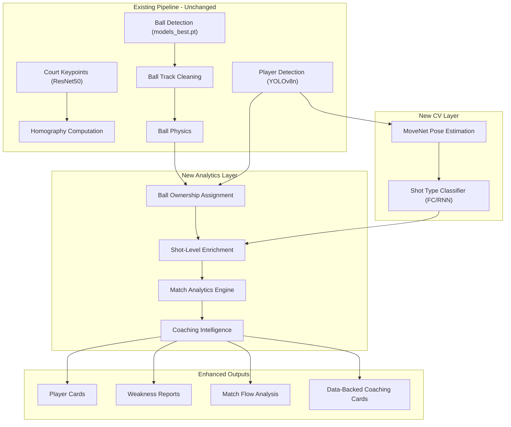

# TennisIQ Analytics Engine Pivot

## Current State

The pipeline currently runs: YOLOv5 ball detection -> heuristic bounce/hit scoring -> point segmentation -> template coaching cards. This produces detection-level data (ball positions, event frames, point boundaries) but no actual tennis analysis. Coaching cards are template strings like "Focus on keeping the ball within court lines."

## Architecture Overview




## Phase 1: Model Swap + Ball Ownership

### 1a. Swap ball detection model to `models_best.pt`

- File: [tennisiq/modal_court.py](tennisiq/modal_court.py) line 106 — change `"ball_yolo5", "yolo5_last.pt"` to `"ball_yolo5", "models_best.pt"`
- File: [tennisiq/io/output.py](tennisiq/io/output.py) line 117 — update checkpoint string in run metadata
- File: [PRD.md](PRD.md) — update all references to `yolo5_last.pt`
- File: [README.md](README.md) — update checkpoint filename

### 1b. Implement ball ownership logic

Create new file: `tennisiq/analytics/shots.py`

Core algorithm (from user spec):

- Detect shot events where ball velocity vector reverses: `v_t . v_{t+1} < 0`
- Assign ownership to nearest player centroid at the shot frame
- Court side heuristic: if ball is above net y-coordinate, Player B hit it; below, Player A
- Combine distance + court side for robust ownership

**Inputs**: `ball_physics: list[BallPhysics]`, `player_results: list[FramePlayers]`, `homographies: list[FrameHomography]`

**Output**: `list[ShotEvent]` dataclass with:

- `frame_idx`, `timestamp_sec`
- `owner`: "player_a" or "player_b"
- `ball_court_xy`: court-space ball position
- `shot_type`: None initially (filled by Phase 2)
- `ball_direction`: direction angle after the shot
- `speed_m_s`: ball speed at shot

This replaces the current `_detect_hits` in [tennisiq/analytics/events.py](tennisiq/analytics/events.py) as the primary shot detection method. The existing bounce detection remains.

## Phase 2: MoveNet Pose Estimation + Shot Classification

### 2a. MoveNet inference module

Create new file: `tennisiq/cv/pose/inference_movenet.py`

- Load `movenet_lightning_f16.tflite` via TensorFlow Lite interpreter
- For each frame where a player is detected, crop the player bounding box from the frame
- Run MoveNet to extract 17 keypoints (nose, shoulders, elbows, wrists, hips, knees, ankles)
- Normalize keypoints relative to the bounding box
- Store per-frame per-player pose: `PlayerPose(frame_idx, player, keypoints_17x3)`

### 2b. Shot type classifier inference

Create new file: `tennisiq/cv/pose/shot_classifier.py`

- Load pre-trained model (`tennis_fc.h5` or `tennis_rnn.h5`) via TensorFlow/Keras
- At each `ShotEvent` frame, extract the pose of the owning player
- For FC model: classify single-frame pose features (24 values: 12 keypoints x 2)
- For RNN model: classify a 30-frame window of poses around the shot frame
- Output: `{"forehand", "backhand", "serve", "neutral"}` with confidence
- Attach `shot_type` to each `ShotEvent`

### 2c. Pipeline integration

In [tennisiq/modal_court.py](tennisiq/modal_court.py), add two new phases between player detection and event detection:

- Phase 5b: MoveNet pose estimation (runs on player bounding boxes)
- Phase 6: Shot events via ball ownership (replaces old hit detection)
- Phase 6b: Shot type classification (attaches types to shot events)

Add new model checkpoint paths to the Modal image mount and to `TENNISIQ_CHECKPOINT_ROOT`.

## Phase 3: Match Analytics Engine

Create new file: `tennisiq/analytics/match_analytics.py`

This module consumes `list[ShotEvent]`, `list[TennisPoint]`, `list[TennisEvent]`, and `ball_physics` to compute:

### Per-Player Stats

- **Shot distribution**: % forehand / backhand / serve / volley
- **Shot direction patterns**: Cross-court vs down-the-line % per shot type
- **Error rate by shot type**: Errors per forehand, per backhand, per serve
- **Error rate by rally length**: Error % in rallies 1-3, 4-6, 7-9, 10+ shots (the "fatigue signal")
- **Serve stats**: First serve %, second serve %, ace %, double fault %, placement distribution, win % per serve zone
- **Average rally speed**: Mean ball speed during player's shots
- **Court coverage**: Distance traveled, center of gravity position

### Match-Level Stats

- **Rally length distribution**: Histogram of rally lengths (shot counts)
- **Shot Pattern Dominance**: For each player, which patterns they use most under which conditions
- **Second Serve Return Performance**: Win % when returning second serves, by return type
- **Momentum tracking**: Rolling window of points won, shifted across the match
- **Break point performance**: Win % under pressure (if game tracking is available, else point-cluster analysis)

### Output

- `analytics.json` — full structured analytics payload
- `player_a_card.json` / `player_b_card.json` — per-player summary cards

## Phase 4: Coaching Intelligence Engine

Create new file: `tennisiq/analytics/coaching_intelligence.py`

This replaces the template-based coaching cards with data-driven insights.

### Player Card Generation

For each player, generate 3-5 sentences of plain-English tendencies:

- "Player A favors cross-court forehands (68% of forehand shots), particularly on the deuce side."
- "Player B's serve is most effective when placed wide on the ad side (72% win rate vs 41% down the T)."

Logic: Rank shot patterns by frequency, identify the dominant 2-3, describe them in natural language with the actual percentages.

### Weakness Report Generation

Identify the top 2-3 most exploitable patterns per player:

- Compare error rates across shot types, rally lengths, and match phases
- Flag any stat that deviates significantly from the player's own average (e.g., backhand error rate in long rallies vs short rallies)
- Rank by "points cost" — how many points this pattern is costing them

Example output: `"Player A's backhand cross-court error rate jumps from 12% to 34% in rallies longer than 7 shots — this pattern cost 5 points in the match."`

### Match Flow Section

- Track rally length trend across the match (rolling average)
- Track shot pattern changes (early vs late match)
- Identify momentum shifts (3+ consecutive points won/lost)

### Enhanced Coaching Cards

Per-point cards now include:

- Specific shot-by-shot breakdown (who hit what, where)
- Why the point ended with actual data (not just "OUT")
- Pattern context: "This was the 3rd consecutive cross-court forehand error"

## Phase 5: Output Structure Updates

### New output files

```
outputs/{job_id}/
  analytics.json              <- Full match analytics
  player_a_card.json          <- Player A card (tendencies, weakness, stats)
  player_b_card.json          <- Player B card
  match_flow.json             <- Match flow data (momentum, rally trends)
  shots.json                  <- All shot events with ownership + type
  coaching_cards.json         <- (REPLACED) Now data-backed insights
  stats.json                  <- (ENHANCED) Now includes per-player breakdowns
```

Update [tennisiq/io/output.py](tennisiq/io/output.py) to write these new files.

Update [backend/main.py](backend/main.py) `/results/{job_id}/data` endpoint to serve them.

Update [backend/modal_runner.py](backend/modal_runner.py) `ResultAccumulator` to merge new data types across segments.

## Phase 6: Frontend Dashboard Updates

### New TypeScript interfaces in [frontend/lib/types.ts](frontend/lib/types.ts)

- `PlayerCard` — tendencies, weaknesses, serve stats, shot distribution
- `WeaknessReport` — list of exploitable patterns with data
- `MatchFlow` — momentum data, rally length trend, shot pattern changes
- `ShotEvent` — individual shot with ownership, type, direction

### New frontend components

- `PlayerCardView.tsx` — Renders player tendency summary, shot distribution pie chart, serve zone win rates
- `WeaknessReport.tsx` — Renders top 2-3 weakness items with data bars and point cost
- `MatchFlowChart.tsx` — SVG line chart of rally length trend and momentum shifts across the match

### Updated components

- `CoachingCards.tsx` — Redesign to show shot-by-shot breakdown per point, pattern context
- Results page ([frontend/app/results/[jobId]/page.tsx](frontend/app/results/[jobId]/page.tsx)) — Add new sections: Player Cards at the top, Weakness Reports, Match Flow, then enhanced Coaching Cards

### Layout priority (user's "dream output" order)

1. Player Cards (plain-English tendencies per player)
2. Weakness Reports (top exploitable patterns with data)
3. Match Flow (rally length and shot pattern drift)
4. Enhanced Coaching Cards (data-backed per-point insights)
5. Existing: Serve Placement, Heatmaps, Point Timeline, Video Player (demo features)

## Dependencies

New Python packages:

- `tensorflow-lite-runtime` or `tflite-runtime` (for MoveNet inference on Modal GPU)
- No new frontend packages needed (SVG charts are hand-built)

New model files (user will provide):

- `checkpoints/ball_yolo5/models_best.pt` — Ball detection model
- `checkpoints/pose/movenet_lightning_f16.tflite` — MoveNet pose model (downloadable from TF Hub)
- `checkpoints/pose/tennis_fc.h5` or `tennis_rnn.h5` — Pre-trained shot classifier

## Risk Mitigation

- **MoveNet on Modal GPU**: TFLite may not have GPU acceleration on CUDA. Fallback: use TF SavedModel format which supports CUDA, or run MoveNet via OpenCV DNN module.
- **Shot classifier not provided yet**: Build the inference pipeline with a mock classifier that returns uniform probabilities, so the full pipeline works end-to-end. When the user provides the model, it drops in.
- **Cross-segment shot context**: A rally spanning a 10s segment boundary will have ownership interrupted. Mitigation: The `ResultAccumulator` already re-indexes points across segments. Extend it to re-index shot events and recompute ownership for boundary shots using carried-forward player positions.

